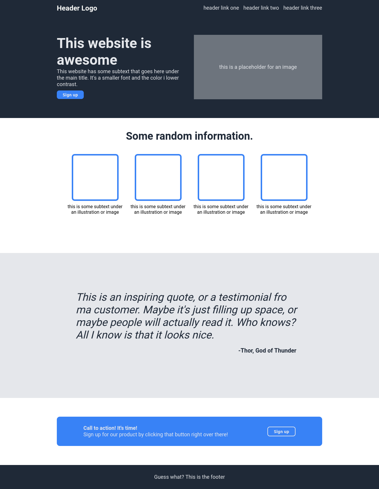

# Landing-Page
For this project I'm going to create an entire web page from a provided design.
The font that’s being used in the images is roboto.
## Desired Outcome

## Fonts & Colours

You can find this project foundation with the instructions <a href="https://www.theodinproject.com/lessons/foundations-landing-page">here</a>. 

## Final Outcome close to desired

I called as final just because the design is quite close as desired. 
But I'm willing to change, inserting images.

